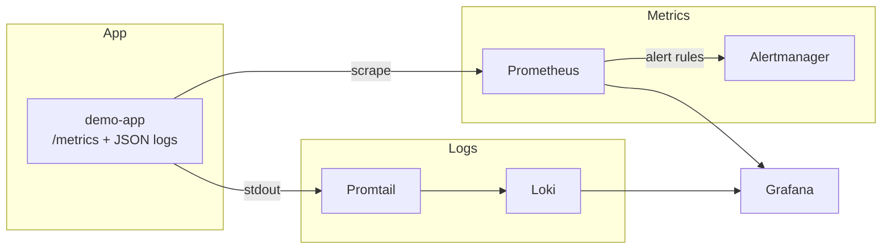
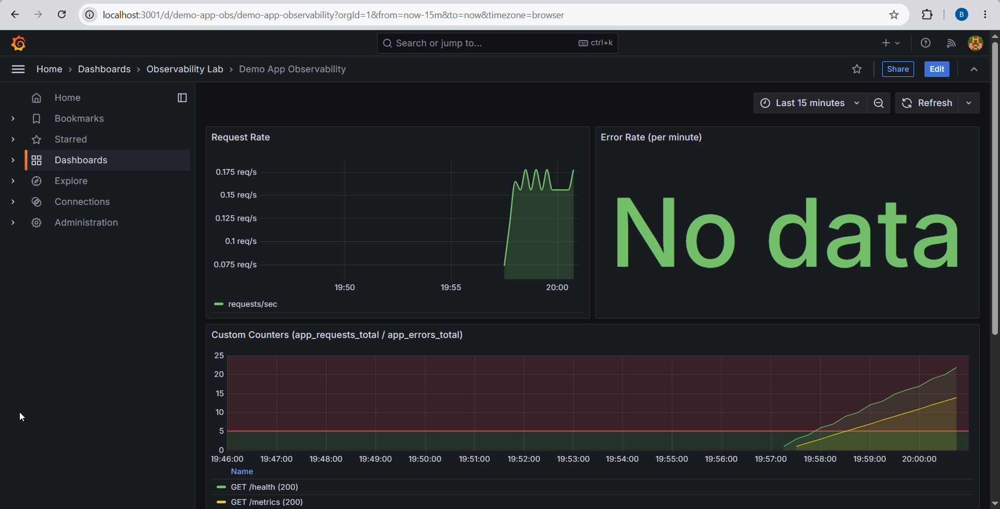
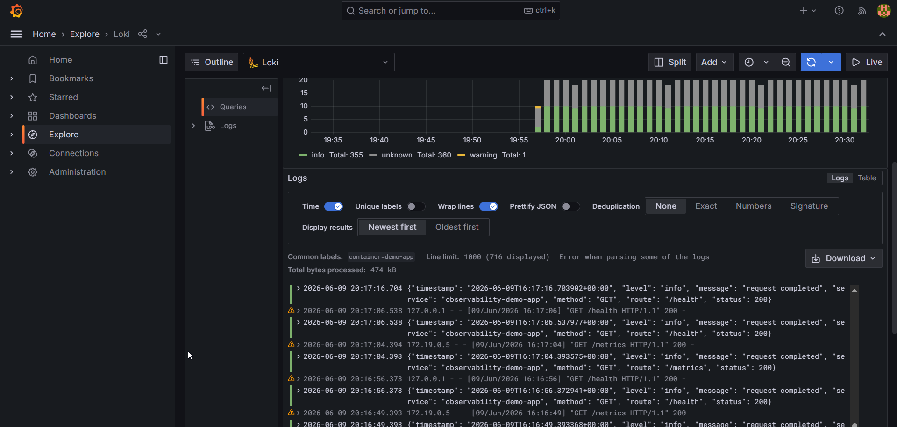
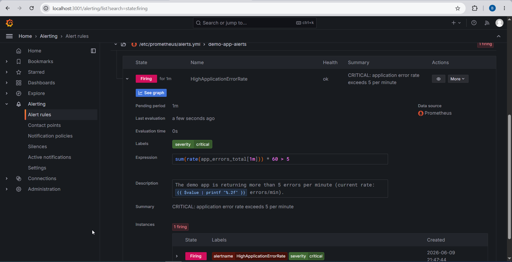

# DevOps Homework 2 — Observability Lab

Flask app in Docker Compose with Prometheus (metrics), Loki/Promtail (logs), and Grafana for visualization.

## Run it

```powershell
docker compose up -d --build
```

| Service      | URL                   | Login         |
|--------------|-----------------------|---------------|
| App          | http://localhost:3000 | —             |
| Grafana      | http://localhost:3001 | admin / admin |
| Prometheus   | http://localhost:9090 | —             |
| Alertmanager | http://localhost:9093 | —             |

```powershell
docker compose down
```

## Architecture



Prometheus scrapes `/metrics` every 15s. Promtail tails the `demo-app` container via the Docker socket and forwards logs to Loki. Grafana queries both datasources. Alert rules live in Prometheus; fired alerts go to Alertmanager.

## Implementation

### Logging

Using **Loki + Promtail** rather than ELK — less overhead and the same Grafana instance covers metrics and logs.

Each request produces a JSON line on stdout with `timestamp`, `level`, `message`, `service`, `method`, `route`, and `status`. Promtail ships container output to Loki; filtering in Explore uses LogQL with a JSON parser stage.

Example line:

```json
{"timestamp":"2026-06-09T16:32:34.392970+00:00","level":"info","message":"request completed","service":"observability-demo-app","method":"GET","route":"/metrics","status":200}
```

LogQL query used for the logs screenshot:

```logql
{container=~".*demo-app.*"} | json
```

Flask's default access-log format also appears in the stream alongside the structured JSON lines.

### Metrics

| Metric               | Type    | Labels                |
|----------------------|---------|-----------------------|
| `app_requests_total` | Counter | method, route, status |
| `app_errors_total`   | Counter | route (5xx only)      |

Counters are defined in `app/server.py` and exposed at `GET /metrics`.

### Alerting

From `prometheus/alerts.yml`:

```yaml
alert: HighApplicationErrorRate
expr: sum(rate(app_errors_total[1m])) * 60 > 5
for: 1m
labels:
  severity: critical
```

The rule evaluates the per-minute error rate and fires with `severity: critical` when it stays above 5 for one minute.

### Simulating the CRITICAL alert

With the stack running:

```powershell
.\scripts\trigger-alert.ps1
```

The script sends repeated requests to `/api/error` over ~60 seconds so the error rate stays above the threshold through the `for: 1m` evaluation window. After running it, check **Grafana → Alerting → Alert rules** (Pending, then Firing) or http://localhost:9090/alerts for the Prometheus-side view.

## Evidence

**Grafana dashboard — custom application metrics**  
Dashboard: Observability Lab → Demo App Observability



**Grafana Explore — filtered JSON logs**  
Loki datasource, query `{container=~".*demo-app.*"} | json`



**Grafana Alerting — active alert rule**  
Alerting → Alert rules → `CRITICAL - High Application Error Rate` in **Firing** state



## Analysis

### Why JSON-structured logging beats plain text

Plain-text logs need regex or substring search that breaks when the format changes. JSON keeps fixed keys (`level`, `route`, `status`), so tools like Loki can parse and filter on fields directly. That makes queries faster and keeps dashboards/alerts from depending on fragile pattern matching.

### Prometheus (metrics) vs Loki (logs)

Prometheus stores numeric time series — counters, rates, aggregates. It's suited for questions like "what's the error rate right now?" and for threshold alerts built on `rate()` and `sum()`.

Loki stores log lines and indexes labels (container, level, etc.), not full message text. It's suited for digging into individual events after a metric shows something is wrong.

Metrics surface trends and trigger alerts; logs provide the surrounding context.

### Long-term log retention (~6 months) without exhausting disk

- Configure **retention limits** (`retention_period` in Loki, ILM in Elasticsearch) so old data is purged on a schedule.
- Use **tiered storage** — recent logs on local disk, older chunks in object storage (S3, GCS, etc.).
- **Filter at ingest** in Promtail to drop low-value debug output early.
- **Downsample or sample** older data when full fidelity isn't needed.
- Enforce **per-service quotas** to prevent one app from consuming all storage.

This setup keeps 7 days locally (`loki-config.yml`); a production deployment would add object storage for anything beyond the hot window.

## Repo layout

```
app/              Flask app + /metrics
prometheus/       scrape config, alert rules
grafana/          datasources, dashboard
loki/             Loki config
promtail/         log shipping
alertmanager/     alert routing
scripts/          trigger-alert.ps1, verify-stack.ps1
docker-compose.yml
```
